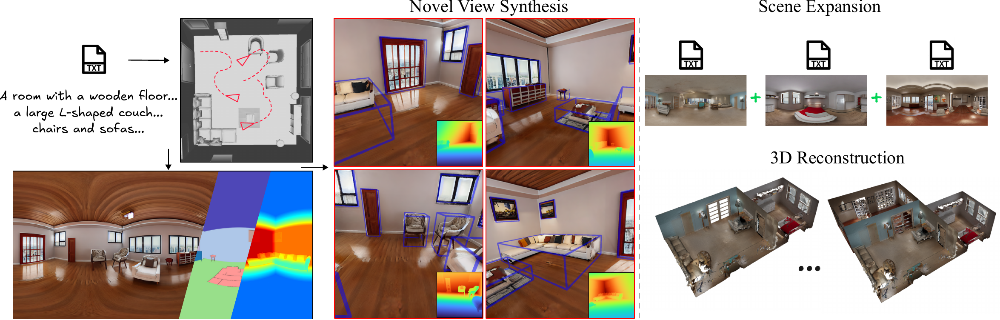

<h1 align="center">Scene Generation at Absolute Scale: Utilizing Semantic and Geometric Guidance From Text for Accurate and Interpretable 3D Indoor Scene Generation</h1>

<p align="center">
  
</p>

<p align="center">
  [<a href="https://arxiv.org/abs/2603.13910">arXiv</a>] [<a href="https://d3ixi.github.io/GuidedSceneGen/">Project Page</a>]
</p>

If you find this project useful, please consider citing our paper:
```
@article{ainetter2026scene,
  title={Scene Generation at Absolute Scale: Utilizing Semantic and Geometric Guidance From Text for Accurate and Interpretable 3D Indoor Scene Generation},
  author={Ainetter, Stefan and Deixelberger, Thomas and Dominici, Edoardo A and Drescher, Philipp and Vardis, Konstantinos and Steinberger, Markus},
  journal={arXiv preprint arXiv:2603.13910},
  year={2026}
}
```
